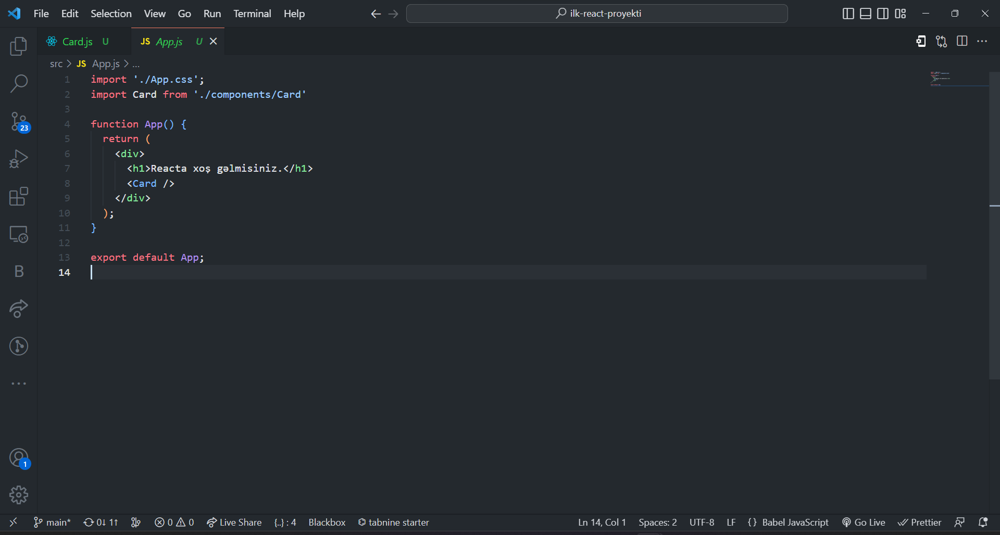

# Başlanğıcda
Əvvəlki dərsdə biz JSX haqqında öyrəndik və CDN-dən istifadə edərək React və ReactDOM paketinə daxil olduq. Bununla belə, CDN əvəzinə real layihələrdə siz React layihəsinin başlanğıcını (boilerplate) yaratmaq üçün create-react-app paketindən istifadə edəcəksiniz. İlkin yaratma-React tətbiqi 22 iyul 2016-cı ildə buraxıldı. Bu vaxta qədər tərtibatçılar veb paketi JavaScript modul paketi, babel və bütün lazımi paketləri əl ilə konfiqurasiya edirdilər və bu, yarım saat və ya bəlkə də daha çox vaxt aparırdı. İndi create-react-app hər şeyin qayğısına qalacaq və siz layihələrin konfiqurasiyasına və qurulmasına çox vaxt sərf etmək əvəzinə, yalnız məhsulun hazırlanması ilə məşğul olacaqsınız. Fərqli alətlərdən istifadə etməyə başlamazdan əvvəl gəlin bu problemdə istifadə edəcəyimiz bütün alətlərlə qısa tanış olaq. Siz hər şeyi başa düşmək məcburiyyətində deyilsiniz, amma mən React ilə işləyərkən istifadə etdiyimiz bəzi alətlər və texnologiyalar haqqında çox qısa məlumat verməyə çalışacağam.

# Node
Node JavaScript-in serverdə işləməsinə imkan verən JavaScript işləmə mühitidir. Node 2009-cu ildə yaradılmışdır. Node JavaScript-in inkişafı üçün böyük rol oynamışdır. React proqramı defolt olaraq localhost 3000-də başlayır. Create-react-app React Tətbiqi üçün qovşaq serverini konfiqurasiya edib. Buna görə də bizə node və node modulları lazımdır.

Əgər node yoxdursa, onu quraşdırın. node.js endirmək üçün [daxil olun](https://nodejs.org) .

Yüklədikdən sonra iki dəfə klikləyin və quraşdırın

Cihaz terminalımızı və ya əmr sorğusunu açıb aşağıdakı əmri yazmaqla node-un komputerimizə quraşdırılıb-qurulmadığını yoxlaya bilərik:
```
node -v
vXX.XX.X
```

# Modul

Lazım olduqda ixrac və idxal edilə bilən tək və ya çoxlu funksiyalar layihəyə daxil edilə bilər. React-da modullara və ya paketlərə daxil olmaq üçün keçiddən istifadə etmirik, əvəzində modulu idxal edirik. Modul və ya modulların necə idxal və ixrac olunacağına baxaq:
```
// App.js
import logo from './logo.svg';
import './App.css';

function App() {
  return (
    <div className="App">
      <header className="App-header">
        
        <p>
          Edit <code>src/App.js</code> and save to reload.
        </p>
        <a
          className="App-link"
          href="https://reactjs.org"
          target="_blank"
          rel="noopener noreferrer"
        >
          Learn React
        </a>
      </header>
    </div>
  );
}

export default App;

```
İndi App.js modullarını başqa fayla idxal edək:

index.js faylına daxil oluruq və kod blokumuzu index faylımızda daxil edirik 
```
import React from 'react';
import ReactDOM from 'react-dom/client';
import './index.css';
import App from './App';
import reportWebVitals from './reportWebVitals';

const root = ReactDOM.createRoot(document.getElementById('root'));
root.render(
  <React.StrictMode>
    <App />
  </React.StrictMode>
);

// If you want to start measuring performance in your app, pass a function
// to log results (for example: reportWebVitals(console.log))
// or send to an analytics endpoint. Learn more: https://bit.ly/CRA-vitals
reportWebVitals();
```

# Paket
Paket bir modul və ya modullar toplusudur. Məsələn, React, ReactDOM paketlərdir.

### Node Paket Meneceri (NPM)
NPM 2010-cu ildə yaradılmışdır. NPM-ni ayrıca quraşdırmaq lazım deyil - node quraşdırdığınız zaman sizdə NPM də olacaq. NPM Node.js üçün defolt paket meneceridir. O, istifadəçilərə reyestrdə mövcud olan JavaScript modullarını istehlak etməyə və yaymağa imkan verir. NPM paketlər yaratmağa, paketlərdən istifadə etməyə və paketləri yaymağa imkan verir. NPM JavaScript-in böyüməsində də kifayət qədər böyük rol oynadı. Hazırda NPM reyestrində 350 000-dən çox paket var. NPM reyestrində create-react-app -a baxaq. [Yükləmələrin sayı](https://www.npmjs.com/package/create-react-app) paketin populyarlığını göstərir.


#### Visual Studio uzantıları (extension)
Bu uzantıları Visual Studio Kodundan quraşdırmaqla React kodlarınızı səliqəli və sürətli yaza bilərsiniz 

- Prettier
- ESLint
- Bracket Pair Colorizer
- ES7 React/Redux/GraphQL/React-Native snippets

### Create React App

React layihəsi yaratmaq üçün aşağıdakı yollardan birini istifadə edə bilərsiniz. Tutaq ki, siz node quraşdırmısınız. Mac və ya Linux-da komanda xətti interfeysini (CLI), git bash və ya terminalı açın. Sonra aşağıdakı əmri yerinə yetirin. Mən VS Code terminalı istifadə edirəm.
```
npx create-react-app proyektin-adi
```

Əgər hər dəfə layihə yaratdığınız zaman npx yazmağı xoşlamırsınızsa, aşağıdakı əmrdən istifadə edərək kompüterinizdə qlobal olaraq create-react-app paketini quraşdıra bilərsiniz.

```
npm install -g create-react-app
```

create-react-app əmrini yazdıqdan sonra aşağıdakı kimi React tətbiqini yaradırsınız:
```
create-react-app proyektin-adi
```

Və ya sadəcə aşağıdakı 3 kod sətrini terminalınızda yazmaqla ilk react proyektinizi yarada bilərsiniz.

```
npx create-react-app ilk-react-proyekti
cd ilk-react-proyekti
npm start
```

İndi React tətbiqiniz localhost 3000-də işləməlidir. App.js-ə gedin və bir az mətn yazaraq məzmunu dəyişdirin, brauzerdə ən son dəyişiklikləri görəcəksiniz. Serveri dayandırmaq üçün CLI-da (terminalda) **Ctr + C** düymələrini basın.


React tətbiqi
create-react-app tərəfindən yaradılmış React-a baxaq. Hər dəfə yeni layihə yaratdığınız zaman create-react-app və layihənin adını işlədirsiniz.


Aşağıdakı React boilerplate-də üç qovluq var:
- node_modules, 
- public və 
- src. 
Bundan əlavə, 
- .gitignore, 
- README.md, 
- package.json və 
- package-lock.json var. 

Bu qovluqları və faylları bilmək lazımdır.

- node_modules - React proqramlarının bütün lazımi node paketlərini saxlayır.

- public
  - index.html - bütün proqramda malik olduğumuz yeganə HTML faylı
  - favicon.ico - ikon faylı
  - manifest.json - tətbiqi mütərəqqi veb proqramı etmək üçün istifadə olunur
  - digər şəkillər - açıq qrafik şəkilləri (açıq qrafik şəkilləri sosial mediada link paylaşıldıqda görünən şəkillərdir)
  - robots.txt - məlumat, əgər veb sayt veb indekslənməyə icazə verirsə

- src
 - App.css, 
 - index.css - müxtəlif CSS fayllarıdır
 - index.js - bütün komponentləri index.html ilə birləşdirməyə imkan verən fayl
 - App.js - Adətən təqdimat komponentlərinin əksəriyyətini idxal etdiyimiz fayl
 - setupTests.js - test işlərinin yazılması üçün
package.json- Proqramların istifadə etdiyi paketlərin siyahısı
 - reportWebVitals.js - Varsayılan olaraq, müxtəlif ölçülərdən istifadə edərək tətbiqinizin performansını ölçməyə və təhlil etməyə imkan verən performans relayerini ehtiva edir.

- .gitignore - React boilerplate git ilə birlikdə gəlir və .gitingore fayl və qovluqların GitHub-a köçürülməməsinə imkan verir.
- README.md - Sənədləri yazmaq üçün Markdown faylı
- package-lock.json - paketin versiyasını kilidləmək üçün bir vasitədir

İndi biz, hazırda ehtiyacımız olmayan faylları silək və yalnız indi ehtiyac duyduğumuz faylları saxlayaq. İşləmək üçün saxladığımız fayllar belədir: 

**Qeyd: Faylları sildikdən sonra, silinmiş fayllarıda index.js və index.html-dən də silməyi unutmayın. Həmçinin css faylları daxilindəki lazımsız kodlarıda silə bilərsiniz.**


İndi isə App.js faylımıza daxil olub burada dəyişikliklər edək və faylımızı save edək.


Artıq brauzerimizə baxdıqda, sonuncu yazdığımız **Reacta xoş gəlmisiniz** yazısı ilə qarşılaşırıq.

# React-da props, map() istifadəsi


İndi isə başqa bir fayl yaradıb bunu tətbiqimizdə istifadə etməyə başlayaq.
Yeni yaradacağımız faylı bir neçə dəfə istifadə edəcəyimizə görə bunu komponent kimi yaratmağımız daha məqsədə uyğun olar. **src** qovluğu daxilində yeni **components** adlı qovluq yaradaq. Yaratdığımız qovluğun içərisində isə **Card.js** adlı fayl yaradaq.

Yuxarıda yüklədiyimiz React extensionu bizə burda sürətli React strukturu qurmaqda kömək edəcək. Card.js faylına daxil olub **rafce** yazıb enter düyməsini sıxdıqda bizim üçün sürətli komponent əsaslı react kodunu daxil etmiş olacaq


Yeni yaratdığımız Card komponenti daxilində istifadəçinin profil şəklini, adını, soyadını, işini, e-poçt ünvanını və əlaqə nömrəsini və bacarıqlarını saxlayacaq məlumatları html teqlərimizlə hazırlayaq. Həmçinin yaratdığımız komponenti tətbiqimizdə görmək üçün isə onu valideyn komponenti olan **App.js** də daxil edək və çağıraq.
```
import './App.css';
import Card from './components/Card'

function App() {
  return (
    <div>
      <h1>Reacta xoş gəlmisiniz.</h1>
      <Card />
    </div>
  );
}

export default App;
```


Əlavə olaraq sadə dizayn işləri üçündə **components** qovluğu daxilində sadəcə Card komponenti üçün istifadə edəcəyimiz css faylı yaradıb, kiçik dizayn işi görək.
```
import React from 'react'
import avatar from './images/avatar.jpg'
import './Card.css'
const Card = () => {
    return (
        <div className="card">
            <div className="card-container">
                
                <h3>Ilkin Zulfi</h3>
                <h6>Baku</h6>
                <p>Front end developer</p>
                <div className="buttons">
                    <a href='mailto:ilkin944@gmail.com' className="primary">
                        Message
                    </a>
                    <a href='tel:+994559443382' className="primary ghost">
                        Call
                    </a>
                </div>
                <div className="skills">
                    <h6>Skills</h6>
                    <ul>
                        <li>Web Development</li>
                    </ul>
                </div>
            </div>
        </div>
    )
}

export default Card
```
Yaratdığımız css faylı içərisində isə bunları əlavə edirik
```
@import url('https://fonts.googleapis.com/css?family=Montserrat');

h3 {
	margin: 10px 0;
}

h6 {
	margin: 5px 0;
	text-transform: uppercase;
}
a{
    text-decoration: none;
}
p {
	font-size: 14px;
	line-height: 21px;
}

.card-container {
	background-color: #231E39;
	border-radius: 5px;
	box-shadow: 0px 10px 20px -10px rgba(0,0,0,0.75);
	color: #B3B8CD;
	padding-top: 30px;
	position: relative;
	width: 350px;
	max-width: 100%;
	text-align: center;
}

.card-container .pro {
	color: #231E39;
	background-color: #FEBB0B;
	border-radius: 3px;
	font-size: 14px;
	font-weight: bold;
	padding: 3px 7px;
	position: absolute;
	top: 30px;
	left: 30px;
}

.card-container .round {
	border: 1px solid #03BFCB;
	border-radius: 50%;
	padding: 7px;
    width: 150px;
    height: 150px;
    object-fit: cover;
}

a.primary {
	background-color: #03BFCB;
	border: 1px solid #03BFCB;
	border-radius: 3px;
	color: #231E39;
	font-family: Montserrat, sans-serif;
	font-weight: 500;
	padding: 10px 25px;
}

a.primary.ghost {
	background-color: transparent;
	color: #02899C;
}

.skills {
	background-color: #1F1A36;
	text-align: left;
	padding: 15px;
	margin-top: 30px;
}

.skills ul {
	list-style-type: none;
	margin: 0;
	padding: 0;
}

.skills ul li {
	border: 1px solid #2D2747;
	border-radius: 2px;
	display: inline-block;
	font-size: 12px;
	margin: 0 7px 7px 0;
	padding: 7px;
}

footer {
    background-color: #222;
    color: #fff;
    font-size: 14px;
    bottom: 0;
    position: fixed;
    left: 0;
    right: 0;
    text-align: center;
    z-index: 999;
}

footer p {
    margin: 10px 0;
}

footer i {
    color: red;
}

footer a {
    color: #3c97bf;
    text-decoration: none;
}
```
Kod sturukturu və görüntüsü belədir


İndi isə brauzerimizdə yaratdığımız görüntünün necə olmasına baxa bilərik. Budur artıq komponent hazırlayıb onu istifadə edə bilirik. İndi isə gələk əsas suala. 

- **Biz hər dəfə yeni istifadəçi üçün yeni komponent mi yaratmalıyıq?** 
- Təbii ki, xeyr! JavaScript biliklərimizi nəzərə alaraq və React-da props (properties sözünün qısa yazılışı) metodundan istifadə edərək, məlumatlarımızı dinamik formada ötürə bilərik. 

İndi isə Card.js faylı daxilində istifadəçiyə məxsus məlumatları (avatar, ad, soyad, şəhər, vəzifə, əlaqə vasitələri və bacarıqları) buradan silib boş jsx strukturunu saxlayaq.

Dinamik formada ötürməli olduğumuz məlumatları artıq App.js faylında Card komponentini yazdığımız yerdə göndərək. (HTML atributlarına bənzər olaraq)
```
<Card profilSekli={profilSekli} ad="Ilkin" soyad="Zulfi" sheher="Baku" vezife="Web Developer" email="ilkin944@gmail.com" tel="+994559443382" bacariq="Web Development"/>
``` 


Göndərdiyimiz məlumatları isə eyni qaydada Card komponenti daxilində alırıq.


Eyni zamanda biz Card komponenti daxilində valideyn komponentdən göndərilən məlumatları *props* açar sözü ilə də qəbul edib istifadə edə bilərik.


Artıq dinamik məlumatları ötürə bildiyimizə görə biz istifadəçi kartlarının çox olacağını nəzərə alaraq bütün istifadəçi kartlarını birlikdə tutacaq komponent hazırlaya və Card komponentimizi onun daxilində istifadə edə bilərik. Əlavə olaraq isə istifadəçiləridə çoxaldaq.

components qovluğu daxilində CardContainer.jsx adlı faylı yaradıb, rafce ilə sürətli React komponentini quraşdıraq və Card.js faylını CardContainer içərisinə import edək. Həmçinin artıq App.js faylımızda Card əvəzində CardContainer import edib məlumatları CardContainer-ə, CardContainer-dən isə Card-a props-ları ötürməliyik.


Budur yenədə nəticəmiz düz işləyir. İndi isə istifadəçilərin sayını çoxaldıb onları bir obyekt daxilində saxlayaq və hər istifadəçi məlumatı əsasında dövr edib Card-ları formalaşdıraq.

Başlanğıcda App.js faylı daxilində bəzi istifadəçi məlumatlarını qeyd etdik. Bu məlumatları isə Card-a yazdıra bilməyimiz üçün Card-ın valideyn komponenti olan CardComponent-ə məlumatları göndəririk.

```
import './App.css';
import CardContainer from './components/CardContainer'
import profilSekli1 from './components/images/avatar.jpg'
import profilSekli2 from './components/images/avatar2.jpg'
import profilSekli3 from './components/images/avatar3.jpg'
import profilSekli4 from './components/images/avatar4.jpg'

function App() {
  const istifadeciler = [
    {
      id: 1,
      avatar: profilSekli1,
      ad: "Ilkin",
      soyad: "Zulfi",
      sheher: "Baku",
      vezife: "Web developer",
      email: "ilkin944@gmail.com",
      tel: "+994559443382",
      bacariq: ["Front End", "Back End", "DB", "Cross Platform", "etc"]
    },
    {
      id: 2,
      avatar: profilSekli2,
      ad: "Elshad",
      soyad: "Khalilov",
      sheher: "Baku",
      vezife: "Jr. Web developer",
      email: "elsad.xalilov1111@gmail.com",
      tel: "+9945512345678",
      bacariq: ["HTML", "CSS", "CSS frameworks", "JavaScript", "React", "etc"]
    },
    {
      id: 3,
      avatar: profilSekli3,
      ad: "Mayis",
      soyad: "Yaqubzade",
      sheher: "Baku",
      vezife: "Jr. Web developer",
      email: "maisyaqubzade@gmail.com",
      tel: "+9945512345678",
      bacariq: ["HTML", "CSS", "CSS frameworks", "JavaScript", "React", "etc"]
    },
    {
      id: 4,
      avatar: profilSekli4,
      ad: "Nicat",
      soyad: "Ismayil",
      sheher: "Roma",
      vezife: "Jr. Web developer",
      email: "ismayilnijat95@gmail.com",
      tel: "+39123456789",
      bacariq: ["HTML", "CSS", "CSS frameworks", "JavaScript", "React", "etc"]
    },
  ]
  return (
    <div className='main'>
      <h1>Reacta xoş gəlmisiniz.</h1>
      <CardContainer
        istifadeciMelumatlari={istifadeciler}
      />
    </div>
  );
}

export default App;
```


CardComponent gələn çoxlu məlumat əsasında dövr edib, nə qədər user varsa ona uyğun olaraq Cardları dövr edib yazdırmalıdır. Bu səbəblə də burada map() metodu vasitəsi ilə gələn məlumatlar üzərində dövr edib həmin məlumatları Card komponentinə ötürürük.
```
import React from 'react'
import Card from './Card'
const CardContainer = ({istifadeciMelumatlari}) => {
  console.log(istifadeciMelumatlari);
  return (
    <div className='card-container'>
      {istifadeciMelumatlari.map(user => (
        <Card
          key={user.id}
          profilSekli={user.avatar}
          ad={user.ad}
          soyad={user.soyad}
          sheher={user.sheher}
          vezife={user.vezife}
          email={user.email}
          tel={user.tel}
          bacariq={user.bacariq}
        />
      ))}
    </div>
  )
}

export default CardContainer
```


Eyni zamanda Card komponenti içərsində istifadəçinin bacarıqlarıda birdən çox olduğuna görə burada dövr edib, bacarıqları ekrana yazdırmağa çalışırıq.
```
import React from 'react'
import './Card.css'
const Card = ({ profilSekli, ad, soyad, sheher, vezife, email, tel, bacariq }) => {
    return (
        <div className="card">
            <div className="card-body">
                
                <h3>{ad} {soyad}</h3>
                <h6>{sheher}</h6>
                <p>{vezife}</p>
                <div className="buttons">
                    <a href={`mailto:${email}`} className="primary">
                        Message
                    </a>
                    <a href={`tel:${tel}`} className="primary ghost">
                        Call
                    </a>
                </div>
                <div className="skills">
                    <h6>Skills</h6>
                    <ul>
                        {bacariq.map((bl, index) => <li key={index}>{bl}</li>)}
                    </ul>
                </div>
            </div>
        </div>
    )
}
export default Card
```


Təbirklər! Brauzerə baxdıqda, istifadəçilərin düzgün formada yerləşdiyini görə bilərik. *(**Card komponentlərinin yan-yana düzülməsi üçün css dəyişikliyi etməyi unutmayın.**)*


# React Hookları, useState və useEffect.

React hooks, React 16.8 və sonraki versiyalarında əlavə edilmiş yeni bir özəllikdir. Bu, React komponentlərində state və digər lifecycle (yaşam döngüsü) və ya React funksionallığını istifadə etmək üçündür. 

Hook-lar JavaScriptdə istifadə etdiyimiz funskiyalardır. Məsələn JavaScriptdə bir funksiya daxilində digər funksiyanı çağırıb işlətdiyimiz kimi Hook-ları da bu formada istifadə edə bilirik.

Hooks, state və side effect-ləri komponentlərdə yaratmaq və yönləndirmək üçün istifadə edilən iki əsas funksiyalardandır. useState hook-u, komponentdə state-i yaratmaq və dəyişdirmək üçün istifadə edilir. useEffect hook-u isə komponentin dəyişdiyi zaman side effect-ləri yaratmaq və yönləndirmək üçün istifadə edilir.

Hooks, komponentlərin daha sadə və oxunabilən olmasını təmin edir. Özəlliklə, hooks-lar, komponentləri state və side effect-lərdən asılı olmayan, yalnızca əsas komponentlərə çevirməyə imkan verir. Bu da komponentlərin daha çox yenidən istifadə edilməsinə və komponentlərin bölünə bilməsinə imkan verir.

Reactda hər hansı hook-u istifadə etmək üçün ilk növbədə onu tətbiqimizə daxil etməliyik. Sonrasında isə onu istifadə edə bilərik.
```
import React, {useState} from 'react';
```

Həmçinin hook-lar üçün bəzi qaydalar da mövcuddur. 
- Hook-lar yalnız React funksiyaları daxilində çağırıla bilər
- Hook-lar komponentin başlanğıcında çağırılmalıdır.
- Şərti hook-lar ola bilməz.

### useState
useState hook-u bizə komponentin vəziyyətini izləməyimizə imkan verir. Məsələn hər hansı komponent başlanğıcda bəzi dəyərlər alır və ya sonradan aldığı dəyərləri öz daxilində saxlayır və s.

useState özündə ilk dəyəri, onu dəyişəcək funksiyanı və başlanğıc dəyəri saxlayır. Həmçinin useState hook-u başlanğıc olaraq istənilən tipdə məlumatı özündə saxlaya bilər. Bu bir rəqəm, strinq, boolean, massiv, obyekt və ya ümumiyyətlə boş ola bilər.
```
const [ilk, setIlk] = useState("başlanğıcda ggöndərmək istədiyimiz");
```
useState hookunu saf JavaScriptdə yazılışı isə bu formadadır:
```
function setIlk() {
  let ilk;
  ilk = "Başlanğıcda göndərmək istədiyimiz";
}
setIlk();
```
Həmçinin biz *setIlk* funksiyamıza kənardan dəyər daxil edib həmin dəyəri də *ilk* dəyişkəninə ötürə bilərik

```
function setIlk(e) {
  let ilk = "Başlanğıcda göndərmək istədiyimiz";
  ilk = e;
}
setIlk("Qonaq");
```

useState-dən istifadə edə bilmək üçün ilk növbədə onu komponentimizə import etməliyik.
```
import React, { useState } from "react";
```
useState hook-u komponentin indiki vəziyyətini və sonrasında dəyişəcəyi funksiyanı özündə saxlayır.

```
import { useState } from "react";

function App() {
  const [ad, setAd] = useState("React");
}
```

indi isə useState vasitəsi ilə yaratdığımız dəyişəni App komponentimizdə istifadə edək
```
function App() {
  const [ad, setAd] = useState("React");
    return (
    <div className='main'>
      <h1>{ad} xoş gəlmisiniz.</h1>
    </div>
  );
}

export default App;
```
Biz burada hər dəfə useState("") içərisindəki məlumatı dəyişdikdə bunun brauzerimizdə də dəyişdiyini görə bilirik.
```
const [ad, setAd] = useState("Qonaq");
```

İndi isə App komponentimizdə *Xoş gəlmisiniz* yazısı olan hissədə dəyişiklik edək və bura bir düymə əlavə edək. Hər dəfə düymə klikləndikdə isə state-mizin dəyəri setAd funksiyası vasitəsi ilə dəyişib *Qonaq* olsun. 
```
<nav className='navbar'>
  <h3>{ad} xoş gəlmisiniz!</h3>
  <button type='button' onClick={() => setAd("Qonaq")}>Dəyiş</button>
</nav>
```
və App.css faylına css kodu əlavə edək
```
.navbar{
    width: 95%;
    height: auto;
    padding: 20px;
    display: flex;
    justify-content: space-between;
    align-items: center;
}
```
Bizim tətbiqimiz yeni açıldıqda *nav* hissədə *React-a xoş gəlmisiniz* yazısı ilə qarşılaşırıq. Ancaq düyməyə klik etdikdə isə yazımız *Qonaq xoş gəlmisinz* ilə əvəzlənmiş olur. Bu isə o deməkdir ki, artıq komponentimizin state-i *"Qonaq"*-dır və bundan sonra biz yeni dəyişənə əsasən işləyə bilərik.


İndi isə useState hook-unu öncəki tapşırığımıza tətbiq edək. Burada İstifadəçiləri göstər və gizlət funksiyası yaradaq. İlk növbədə useState import etməli sonrasında isə App komponentimizdə istifadəçiləri göstərmək və gizlətmək üçün bir düymə əlavə etməliyik. State-miz başlanğıcda istifadəçiləri göstərə bilməsi üçün ona ilkin dəyər olaraq *true* göndərək. Düymə klikləndikdə isə, əgər bizim state-miz *true*-dursa, *false* olacaq və ya əksi. Həmçinin bizim state-miz true olarsa CardContaineri göstərək.

```
import './App.css';
import { useState } from 'react';
import CardContainer from './components/CardContainer'
import profilSekli1 from './components/images/avatar.jpg'
import profilSekli2 from './components/images/avatar2.jpg'
import profilSekli3 from './components/images/avatar3.jpg'
import profilSekli4 from './components/images/avatar4.jpg'

function App() {
  // Navbar-da adı göstərmək və dəyişmək üçün yazdığımız state.
  const [ad, setAd] = useState("React-a");
  // İstifadəçiləri göstərmək və ya gizlətmək üçün state-miz.
  const [goster, setGoster] = useState(true)
  const istifadeciler = [
    {
      id: 1,
      avatar: profilSekli1,
      ad: "Ilkin",
      soyad: "Zulfi",
      sheher: "Baku",
      vezife: "Web developer",
      email: "ilkin944@gmail.com",
      tel: "+994559443382",
      bacariq: ["Front End", "Back End", "DB", "Cross Platform", "etc"]
    },
    {
      id: 2,
      avatar: profilSekli2,
      ad: "Elshad",
      soyad: "Khalilov",
      sheher: "Baku",
      vezife: "Jr. Web developer",
      email: "elsad.xalilov1111@gmail.com",
      tel: "+9945512345678",
      bacariq: ["HTML", "CSS", "CSS frameworks", "JavaScript", "React", "etc"]
    },
    {
      id: 3,
      avatar: profilSekli3,
      ad: "Mayis",
      soyad: "Yaqubzade",
      sheher: "Baku",
      vezife: "Jr. Web developer",
      email: "maisyaqubzade@gmail.com",
      tel: "+9945512345678",
      bacariq: ["HTML", "CSS", "CSS frameworks", "JavaScript", "React", "etc"]
    },
    {
      id: 4,
      avatar: profilSekli4,
      ad: "Nicat",
      soyad: "Ismayil",
      sheher: "Roma",
      vezife: "Jr. Web developer",
      email: "ismayilnijat95@gmail.com",
      tel: "+39123456789",
      bacariq: ["HTML", "CSS", "CSS frameworks", "JavaScript", "React", "etc"]
    },
  ]
  return (
    <div className='main'>
      <nav className='navbar'>
        <h3>{ad} xoş gəlmisiniz!</h3>
        <button type='button' onClick={() => setAd("Qonaq")}>Dəyiş</button>
         {/* Düyməyə klikləndikdə setGoster metodu hazırki göstər dəyərini əksinə çevirir (true -> false və ya false -> true ) */}
        <button type='button' onClick={() => setGoster(!goster)}>
        {/* goster dəyişəninin dəyəri varsa və ya true olarsa Gizlət yazısı yazılsın, false olarsa Göstər yazısı yazılsın */}
          {goster ? "Gizlət" : "Göstər"}
        </button>
      </nav>
      {/* Həmçinin goster dəyişəninin dəyəri true-dursa bizə CardContainer-ini göstərsin, əks halda isə heç bir nəticə olmasın */}
      {
        goster && (<CardContainer
          istifadeciMelumatlari={istifadeciler}
        />)
      }
    </div>
  );
}

export default App;
```

Nəticəni uğurla əldə etdiyimizə görə indi biraz daha çətinləşdirə bilərik. İndi isə, əgər bizim hər hansı istifadəçimiz olmadığı təqdirdə bizə "heç bir istifadəçi yoxdur" yazısı ilə qarşılaşa bilməyimiz üçün CardContainerdə dəyişiklik edək. Bunun üçün ilk növbədə CardContainer komponentimizdə bizə göndərilən məlumatın dəyərinin 0 olub olmadığını yoxlamaq və onun üzərində çalışmağımız lazımdır.

```
import React from 'react'
import Card from './Card'
const CardContainer = ({istifadeciMelumatlari}) => {
  if(istifadeciMelumatlari.length === 0){
    return <div>Heç bir istifadəçi yoxdur</div>
  }
  return (
    <div className='card-container'>
      {istifadeciMelumatlari.map(user => (
        <Card
          key={user.id}
          profilSekli={user.avatar}
          ad={user.ad}
          soyad={user.soyad}
          sheher={user.sheher}
          vezife={user.vezife}
          email={user.email}
          tel={user.tel}
          bacariq={user.bacariq}
        />
      ))}
    </div>
  )
}

export default CardContainer
```
İndi isə kodumuzun işləyib işləmədiyini bilməyimiz üçün App.js-də *istifadeciler* arrayının içərisində olan obyektlərimizi silək. Budur, nəticə uğurludur. İstifadəçilərimiz olmadığı halda, "Heç bir istifadəçi yoxdur" yazısı ilə qarşılaşır, istifadəçi olduqda isə istifadəçi kartını görə bilirik.


### useEffect Hooku

Side effect-lər, komponentin işləməsinin ətrafındakı sistemdən və ya komponentin daxili məlumatlarından asılı olmayan dəyişikliklər yaratmasına səbəb ola bilər. Bu dəyişikliklər arasında:

- API-lardan məlumat yükləmə və yazma
- LocalStorage-da məlumat yazma və silmə
- Cookies-da məlumat yazma və silmə
- DOM-da dəyişikliklər yaradma
- Browser Event-larını qeyd etmə və silmə
- Timers və Intervals-ı qeyd etmə və silmə

React, useEffect hook-unu istifadə edərək komponentin side effect-lərini yaratmaq və yönləndirmək üçün istifadə edilir. Bu hook-un ikinci parametri olur, side effect-i yaradılacaq zamanın təyin edilməsi üçün istifadə edilir. Nümunə: API-dan məlumatların yalnız ilk dəfə yüklənməsi üçün useEffect hook-unun ikinci parametri boş massiv [] olur.

Side effect-lər, komponentin çalışmasının ətrafındakı sistemdən və ya komponentin daxili məlumatlarından asılı olmayan dəyişikliklər yaratması üçündür. Bu səbəbdən də, side effect-lər, komponentin daha çox test edilməsinin və yönləndirilməsinin çətinləşməsinə səbəb ola bilər.


İndi isə useEffect hook-unu istifadəçilərimizin olduğu layihədə istifadə edək. Biz məlumatı öncədən statik olaraq saxlayırdıq, lakin istifadəçilərin dəyişməsi dinamik olan məlumatdır və bizdə bu məlumatı dinamik formada kənar API-dən istifadə edərək çəkə və səhifəmizə yerləşdirə bilərik. Bunun üçün hazır fake API-dən istifadə edəcəyik. Fake API üçün [buraya keçid et](https://dummyjson.com/)

İlk növbədə App.js faylımızda olan və alt komponentlərə ötürdüyümüz istifadəçi məlumatlarını artıq silə bilərik, çünki məlumatlar bizə API-dən CardContainerə gələcək.


CardContainer.js faylımızda isə useEffect vasitəsi ilə Kənar API-yə müraciət edəcək və gələn məlumatları istifadə edəcəyik. Həmçinin biz burada məlumatları saxlaya bilməmiz üçün də useState hook-dan istifadə etməliyik.
```
import React, { useState, useEffect } from 'react'
import Card from './Card'
const CardContainer = () => {
  // istifadəçi məlumatlarını saxlaya biləcəyimiz users state-ni yaradırıq.
  const [users, setUsers] = useState([]);
  // istifadəçi məlumatlarını kənar mənbədən gətirə bilmək üçün isə useEffect vasitəsi ilə apiyə fetch üsulu ilə müraciət edib gələn
  // api-dən qayıdan cavabı ilk növbədə json-a çevirir sonra isə datanı setUsers funksiyası ilə statemizə əlavə edirik 
  // APİ-də istifadəçi məlumatı data massivi içərisində users adlı obyektdə saxlanılıb
  useEffect(() => {
    fetch('https://dummyjson.com/users')
    .then(response => response.json())
    .then(data => setUsers(data.users));
  }, []);

  return (
    <div className='card-container'>
      {/* Əgər istifadəçi məlumatları varsa - yəni uzunluq 0 -dan böyükdürsə bizə React Fraqmenti içərisində users üzərində dövr edib
          Card komponentini qaytar, YOX məlumat yoxdursa yəni uzunluq sıfırdırsa div içərisində Heç bir istifadəçi yoxdur sözünü qaytarırıq.
      */}
      {users.length ? (
        <>
          {
            users.map(user => (
              <Card
              key={user.id}
              image={user.image}
              firstName={user.firstName}
                lastName={user.lastName}
                city={user.address.city}
                title={user.company.title}
                email={user.email}
                phone={user.phone}
                gender={user.gender}
                />
                ))
              }
        </>
      ) : (<div>Heç bir istifadəçi yoxdur</div>)}
    </div>
  )
}
export default CardContainer
```


Həmçinin gələn data-da məlumatlar öncəki nümunəmizdən fərqli olduğu üçün Card komponentimizdə də dəyişiklik edirik
```
import React from 'react'
import './Card.css'
const Card = ({ image, firstName, lastName, city, title, email, phone, gender }) => {
    return (
        <div className="card">
            <div className="card-body">
                
                <h3>{firstName} {lastName}</h3>
                <h6>{city}</h6>
                <p>{title}</p>
                <div className="buttons">
                    <a href={`mailto:${email}`} className="primary">
                        Message
                    </a>
                    <a href={`tel:${phone}`} className="primary ghost">
                        Call
                    </a>
                </div>
                <div className="skills">
                    <h6>Gender: <span>{gender}</span></h6>
                    
                </div>
            </div>
        </div>
    )
}
export default Card
```


Yekun olaraq nəticəyə baxsaq demo məlumatlardan ibarət datanı uğurla çəkib state-içərisində daxil edə bildik.
