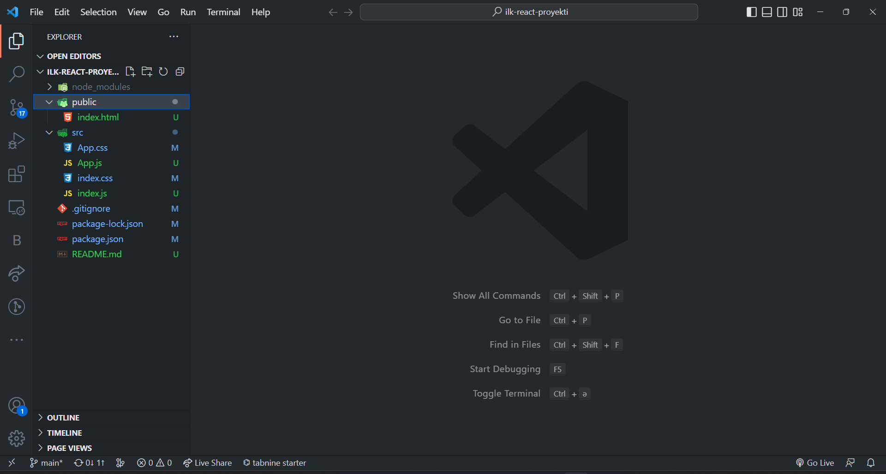

# Başlanğıcda
Əvvəlki dərsdə biz JSX haqqında öyrəndik və CDN-dən istifadə edərək React və ReactDOM paketinə daxil olduq. Bununla belə, CDN əvəzinə real layihələrdə siz React layihəsinin başlanğıcını (boilerplate) yaratmaq üçün create-react-app paketindən istifadə edəcəksiniz. İlkin yaratma-React tətbiqi 22 iyul 2016-cı ildə buraxıldı. Bu vaxta qədər tərtibatçılar veb paketi JavaScript modul paketi, babel və bütün lazımi paketləri əl ilə konfiqurasiya edirdilər və bu, yarım saat və ya bəlkə də daha çox vaxt aparırdı. İndi create-react-app hər şeyin qayğısına qalacaq və siz layihələrin konfiqurasiyasına və qurulmasına çox vaxt sərf etmək əvəzinə, yalnız məhsulun hazırlanması ilə məşğul olacaqsınız. Fərqli alətlərdən istifadə etməyə başlamazdan əvvəl gəlin bu problemdə istifadə edəcəyimiz bütün alətlərlə qısa tanış olaq. Siz hər şeyi başa düşmək məcburiyyətində deyilsiniz, amma mən React ilə işləyərkən istifadə etdiyimiz bəzi alətlər və texnologiyalar haqqında çox qısa məlumat verməyə çalışacağam.

# Node
Node JavaScript-in serverdə işləməsinə imkan verən JavaScript işləmə mühitidir. Node 2009-cu ildə yaradılmışdır. Node JavaScript-in inkişafı üçün böyük rol oynamışdır. React proqramı defolt olaraq localhost 3000-də başlayır. Create-react-app React Tətbiqi üçün qovşaq serverini konfiqurasiya edib. Buna görə də bizə node və node modulları lazımdır.

Əgər node yoxdursa, onu quraşdırın. node.js endirmək üçün [daxil olun](https://nodejs.org) .

Yüklədikdən sonra iki dəfə klikləyin və quraşdırın

Cihaz terminalımızı və ya əmr sorğusunu açıb aşağıdakı əmri yazmaqla node-un komputerimizə quraşdırılıb-qurulmadığını yoxlaya bilərik:
```
node -v
vXX.XX.X
```

# Modul

Lazım olduqda ixrac və idxal edilə bilən tək və ya çoxlu funksiyalar layihəyə daxil edilə bilər. React-də modullara və ya paketlərə daxil olmaq üçün keçiddən istifadə etmirik, əvəzində modulu idxal edirik. Modul və ya modulların necə idxal və ixrac olunacağına baxaq:
```
// math.js
export const topla = (a, b) => a + b
export const vur = (a, b) => a * b
export const cix = (a, b) => a - b

export default (function Hesablama() {
  return {
    topla,
    vur,
    cix,
  }
})()
```
İndi math.js modullarını başqa fayla idxal edək:

```
// index.js
// hesablamanı math.js-dən index faylımızda daxil edirik 
import hesabalama from './math.js'

// digər modulları daxil etmək
// bu modullar default olaraq eksport edilmədiyinə görə onları desctructure ilə dağıdırıq
import { topla, vur, cix } from './math.js'

import * as everything from './math.js' // buradan olan hərbirşeyin daxil olması
console.log(topla(5, 5))
console.log(hesabla.topla(5, 5))
console.log(hersey)
```
Bundan sonra, 'react'-dan React-ı və ya 'react-dom'-dan ReactDOM-u idxal etdiyini görəndə təəccüblənməyəcəksiniz.

# Paket
Paket bir modul və ya modullar toplusudur. Məsələn, React, ReactDOM paketlərdir.

### Node Paket Meneceri (NPM)
NPM 2010-cu ildə yaradılmışdır. NPM-ni ayrıca quraşdırmaq lazım deyil - node quraşdırdığınız zaman sizdə NPM də olacaq. NPM Node.js üçün defolt paket meneceridir. O, istifadəçilərə reyestrdə mövcud olan JavaScript modullarını istehlak etməyə və yaymağa imkan verir. NPM paketlər yaratmağa, paketlərdən istifadə etməyə və paketləri yaymağa imkan verir. NPM JavaScript-in böyüməsində də kifayət qədər böyük rol oynadı. Hazırda NPM reyestrində 350 000-dən çox paket var. NPM reyestrində create-react-app -a baxaq. [Yükləmələrin sayı](https://www.npmjs.com/package/create-react-app) paketin populyarlığını göstərir.


Visual Studio uzantıları (extension)
Bu uzantıları Visual Studio Kodundan quraşdırmalı ola bilərsiniz

- Prettier
- ESLint
- Bracket Pair Colorizer
- ES7 React/Redux/GraphQL/React-Native snippets

### Create React App

React layihəsi yaratmaq üçün aşağıdakı yollardan birini istifadə edə bilərsiniz. Tutaq ki, siz node quraşdırmısınız. Mac və ya Linux-da komanda xətti interfeysini (CLI), git bash və ya terminalı açın. Sonra aşağıdakı əmri yerinə yetirin. Mən VS Code terminalı istifadə edirəm.
```
npx create-react-app proyektin-adi
```

Əgər hər dəfə layihə yaratdığınız zaman npx yazmağı xoşlamırsınızsa, aşağıdakı əmrdən istifadə edərək kompüterinizdə qlobal olaraq create-react-app paketini quraşdıra bilərsiniz.

```
npm install -g create-react-app
```
Create-react-app proqramını quraşdırdıqdan sonra aşağıdakı kimi React tətbiqini yaradırsınız:

```
create-react-app proyektin-adi
```

Və ya sadəcə aşağıdakı 3 kod sətrini terminalınızda yazmaqla ilk react proyektinizi yarada bilərsiniz.
```
npx create-react-app ilk-react-proyekti
```
```
cd ilk-react-proyekti
```

```
npm start
```

İndi React tətbiqiniz localhost 3000-də işləməlidir. App.js-ə gedin və bir az mətn yazaraq məzmunu dəyişdirin, brauzerdə ən son dəyişiklikləri görəcəksiniz. Serveri dayandırmaq üçün CLI-da (terminalda) **Ctr + C** düymələrini basın.


React tətbiqi
Create-react-app tərəfindən yaradılmış React-a baxaq. Hər dəfə yeni layihə yaratdığınız zaman create-react-app və layihənin adını işlədirsiniz.

Aşağıdakı React boilerplate-də üç qovluq var:
- node_modules, 
- public və 
- src. 
Bundan əlavə, 
- .gitignore, 
- README.md, 
- package.json və 
- package-lock.json var. 

Bu qovluqları və faylları bilmək lazımdır.

- node_modules - React proqramlarının bütün lazımi node paketlərini saxlayır.

- public
  - index.html - bütün proqramda malik olduğumuz yeganə HTML faylı
  - favicon.ico - ikon faylı
  - manifest.json - tətbiqi mütərəqqi veb proqramı etmək üçün istifadə olunur
  - digər şəkillər - açıq qrafik şəkilləri (açıq qrafik şəkilləri sosial mediada link paylaşıldıqda görünən şəkillərdir)
  - robots.txt - məlumat, əgər veb sayt veb indekslənməyə icazə verirsə

- src
 - App.css, 
 - index.css - müxtəlif CSS fayllarıdır
 - index.js - bütün komponentləri index.html ilə birləşdirməyə imkan verən fayl
 - App.js - Adətən təqdimat komponentlərinin əksəriyyətini idxal etdiyimiz fayl
 - setupTests.js - test işlərinin yazılması üçün
package.json- Proqramların istifadə etdiyi paketlərin siyahısı
 - reportWebVitals.js - Varsayılan olaraq, müxtəlif ölçülərdən istifadə edərək tətbiqinizin performansını ölçməyə və təhlil etməyə imkan verən performans relayerini ehtiva edir.

- .gitignore - React boilerplate git ilə birlikdə gəlir və .gitingore fayl və qovluqların GitHub-a köçürülməməsinə imkan verir.
- README.md - Sənədləri yazmaq üçün Markdown faylı
- package-lock.json - paketin versiyasını kilidləmək üçün bir vasitədir

İndi biz, hazırda ehtiyacımız olmayan bütün faylları silək və yalnız indi ehtiyac duyduğumuz faylları saxlayaq.

Faylların əksəriyyətini sildikdən sonra boilerplate quruluşu belə görünür:


React qazan lövhəsi təmizləndi

İndi index.js üzərinə kod yazaq. Əvvəlcə React və ReactDOM-u idxal etməliyik. React bizə JSX-i DOM-da göstərmək üçün JSX və ReactDOM yazmağa imkan verir. ReactDOM render metoduna malikdir. Gəlin 2-ci gündə yaratdığımız bütün JSX elementlərindən istifadə edək. ReactDOM render metodu iki parametr, JSX və ya komponent və kök alır.

//index.js
// importing the react and react-dom package

import React from 'react'
import ReactDOM from 'react-dom'

const jsxElement = <h1>This is a JSX element</h1>
const rootElement = document.getElementById('root')

ReactDOM.render(jsxElement, rootElement)
<!-- index.html -->
<!DOCTYPE html>
<html lang="en">
  <head>
    <meta charset="utf-8" />
    <meta name="viewport" content="width=device-width, initial-scale=1" />
    <link
      href="https://fonts.googleapis.com/css?family=Montserrat:300,400,500|Roboto:300,400,500&display=swap"
      rel="stylesheet"
    />
    <meta
      name="description"
      content="Web site created using create-react-app"
    />

    <title>30 Days Of React App</title>
  </head>
  <body>
    <div id="root"></div>
  </body>
</html>
Tətbiqiniz işləmirsə, layihə qovluğuna gedin və aşağıdakı əmri işlədin

Asabeneh@DESKTOP-KGC1AKC MINGW64 ~/Desktop/30-days-of-react (master)
\$ npm start
Hər hansı bir səhviniz yoxdursa, React tətbiqiniz brauzerdə işə salınacaq.

React yaratmaq proqramından istifadə edərək JSX

Gəlin daha çox JSX elementləri yazaq və onları brauzerdə göstərək. Bu ifadə h2 HTML elementindən hazırlanmış JSX elementidir.

const title = <h2>Getting Started React</h2>
Gəlin əvvəlki JSX-ə daha çox məzmun əlavə edək və adı başlığa dəyişdirək.

const header = (
  <header>
    <h1>Welcome to 30 Days Of React</h1>
    <h2>Getting Started React</h2>
    <h3>JavaScript Library</h3>
  </header>
)
Gəlin bunu brauzerə göstərək, bunun üçün bizə ReactDOM lazımdır.

//index.js
// importing the react and react-dom package

import React from 'react'
import ReactDOM from 'react-dom'

const header = (
  <header>
    <h1>Welcome to 30 Days Of React</h1>
    <h2>Getting Started React</h2>
    <h3>JavaScript Library</h3>
    <p>Asabeneh Yetayeh</p>
    <small>Oct 2, 2020</small>
  </header>
)
const rootElement = document.getElementById('root')

ReactDOM.render(header, rootElement)
React yaratmaq proqramından istifadə edərək JSX

İndi 2-ci gündə yaratdığımız bütün JSX-ləri əlavə edək.

//index.js
// importing the react and react-dom package
import React from 'react'
import ReactDOM from 'react-dom'

// JSX element, header
const header = (
  <header>
    <h1>Welcome to 30 Days Of React</h1>
    <h2>Getting Started React</h2>
    <h3>JavaScript Library</h3>
    <p>Asabeneh Yetayeh</p>
    <small>Oct 2, 2020</small>
  </header>
)

// JSX element, main
const main = (
  <main>
    <p>Prerequisite to get started react.js:</p>
    <ul>
      <li>HTML</li>
      <li>CSS</li>
      <li>JavaScript</li>
    </ul>
  </main>
)

// JSX element, footer
const footer = (
  <footer>
    <p>Copyright 2020</p>
  </footer>
)

// JSX element, app, a container or a parent
const app = (
  <div>
    {header}
    {main}
    {footer}
  </div>
)

const rootElement = document.getElementById('root')
// we render the JSX element using the ReactDOM package
// ReactDOM has the render method and the render method takes two argument
ReactDOM.render(app, rootElement)
// or
//  ReactDOM.render([header, main, footer], rootElement)
JSX daha çox jsx göstərmək üçün React tətbiqini yaradıb

JSX-də üslublar
JSX elementlərinə üslub tətbiq edək. Biz JSX-i daxili, daxili və ya xarici CSS üslublarından istifadə edərək tərtib edə bilərik. İndi hər JSX elementinə daxili üslubları tətbiq edək.

// index.js
import React from 'react'
import ReactDOM from 'react-dom'

const headerStyles = {
  backgroundColor: '#61DBFB',
  fontFamily: 'Helvetica Neue',
  padding: 25,
  lineHeight: 1.5,
}

// JSX element, header
const header = (
  <header style={headerStyles}>
    <div className='header-wrapper'>
      <h1>Welcome to 30 Days Of React</h1>
      <h2>Getting Started React</h2>
      <h3>JavaScript Library</h3>
      <p>Asabeneh Yetayeh</p>
      <small>Oct 2, 2020</small>
    </div>
  </header>
)

// JSX element, main
const mainStyles = {
  backgroundColor: '#F3F0F5',
}
const main = (
  <main style={mainStyles}>
    <p>Prerequisite to get started react.js:</p>
    <ul>
      <li>HTML</li>
      <li>CSS</li>
      <li>JavaScript</li>
    </ul>
  </main>
)

const footerStyles = {
  backgroundColor: '#61DBFB',
}
// JSX element, footer
const footer = (
  <footer style={footerStyles}>
    <p>Copyright 2020</p>
  </footer>
)

// JSX element, app
const app = (
  <div className='app'>
    {header}
    {main}
    {footer}
  </div>
)

const rootElement = document.getElementById('root')
// we render the JSX element using the ReactDOM package
ReactDOM.render(app, rootElement)
Daxili üslub JSX

İndi daxili üslubu tətbiq edək, biz bütün CSS-ni index.html başlığına qoyuruq.

// index.js
import React from 'react'
import ReactDOM from 'react-dom'
// JSX element, header
const header = (
  <header>
    <div className='header-wrapper'>
      <h1>Welcome to 30 Days Of React</h1>
      <h2>Getting Started React</h2>
      <h3>JavaScript Library</h3>
      <p>Instructor: Asabeneh Yetayeh</p>
      <small>Date: Oct 1, 2020</small>
    </div>
  </header>
)

// JSX element, main
const main = (
  <main>
    <div className='main-wrapper'>
      <p>
        Prerequisite to get started{' '}
        <strong>
          <em>react.js</em>
        </strong>
        :
      </p>
      <ul>
        <li>HTML</li>
        <li>CSS</li>
        <li> JavaScript</li>
      </ul>
    </div>
  </main>
)

// JSX element, footer
const footer = (
  <footer>
    <div className='footer-wrapper'>
      <p>Copyright 2020</p>
    </div>
  </footer>
)

// JSX element, app
const app = (
  <div className='app'>
    {header}
    {main}
    {footer}
  </div>
)

const rootElement = document.getElementById('root')
// we render the JSX element using the ReactDOM package
ReactDOM.render(app, rootElement)
Daxili üslub JSX

JSX elementlərinə verilənlərin yeridilməsi
// index.js
import React from 'react'
import ReactDOM from 'react-dom'
// To get the root element from the HTML document

// JSX element, header
const welcome = 'Welcome to 30 Days Of React'
const title = 'Getting Started React'
const subtitle = 'JavaScript Library'
const author = {
  firstName: 'Asabeneh',
  lastName: 'Yetayeh',
}
const date = 'Oct 2, 2020'

// JSX element, header
const header = (
  <header>
    <div className='header-wrapper'>
      <h1>{welcome}</h1>
      <h2>{title}</h2>
      <h3>{subtitle}</h3>
      <p>
        Instructor: {author.firstName} {author.lastName}
      </p>
      <small>Date: {date}</small>
    </div>
  </header>
)

const numOne = 3
const numTwo = 2

const result = (
  <p>
    {numOne} + {numTwo} = {numOne + numTwo}
  </p>
)

const yearBorn = 1820
const currentYear = new Date().getFullYear()
const age = currentYear - yearBorn
const personAge = (
  <p>
    {' '}
    {author.firstName} {author.lastName} is {age} years old
  </p>
)

// JSX element, main
const techs = ['HTML', 'CSS', 'JavaScript']
const techsFormatted = techs.map((tech) => <li>{tech}</li>)

// JSX element, main
const main = (
  <main>
    <div className='main-wrapper'>
      <p>
        Prerequisite to get started{' '}
        <strong>
          <em>react.js</em>
        </strong>
        :
      </p>
      <ul>{techsFormatted}</ul>
      {result}
      {personAge}
    </div>
  </main>
)

const copyRight = 'Copyright 2020'

// JSX element, footer
const footer = (
  <footer>
    <div className='footer-wrapper'>
      <p>{copyRight}</p>
    </div>
  </footer>
)

// JSX element, app
const app = (
  <div className='app'>
    {header}
    {main}
    {footer}
  </div>
)

const rootElement = document.getElementById('root')
// we render the JSX element using the ReactDOM package
ReactDOM.render(app, rootElement)
Daxili üslub JSX

Reactda media obyektlərinin idxalı
React-də şəkillər, video və audioları necə idxal edirik? Əvvəlcə şəkilləri necə idxal etdiyimizə baxaq. src qovluğunda şəkillər qovluğu yaradın və içərisində bir şəkil saxlayın. Məsələn, asabeneh.jpg şəklini saxlayaq və bu şəkli index.js-ə idxal edək. Import etdikdən sonra onu JSX ifadəsinə yeridəcəyik, istifadəçi. Aşağıdakı koda baxın.

// index.js
import React from 'react'
import ReactDOM from 'react-dom'
import asabenehImage from './images/asabeneh.jpg'

const user = (
  <div>
    
  </div>
)

const rootElement = document.getElementById('root')
// we render the JSX element using the ReactDOM package
ReactDOM.render(user, rootElement)
Təsvirin göstərilməsi

İstifadəçini əsas JSX elementinə daxil edək və nəticəyə baxaq:

// index.js
import React from 'react'
import ReactDOM from 'react-dom'
// To get the root element from the HTML document
import asabenehImage from './images/asabeneh.jpg'
// JSX element, header
const welcome = 'Welcome to 30 Days Of React'
const title = 'Getting Started React'
const subtitle = 'JavaScript Library'
const author = {
  firstName: 'Asabeneh',
  lastName: 'Yetayeh',
}
const date = 'Oct 2, 2020'

// JSX element, header
const header = (
  <header>
    <div className='header-wrapper'>
      <h1>{welcome}</h1>
      <h2>{title}</h2>
      <h3>{subtitle}</h3>
      <p>
        Instructor: {author.firstName} {author.lastName}
      </p>
      <small>Date: {date}</small>
    </div>
  </header>
)

const numOne = 3
const numTwo = 2

const result = (
  <p>
    {numOne} + {numTwo} = {numOne + numTwo}
  </p>
)

const yearBorn = 1820
const currentYear = new Date().getFullYear()
const age = currentYear - yearBorn
const personAge = (
  <p>
    {' '}
    {author.firstName} {author.lastName} is {age} years old
  </p>
)

// JSX element, main
const techs = ['HTML', 'CSS', 'JavaScript']
const techsFormatted = techs.map((tech) => <li>{tech}</li>)

const user = (
  <div>
    
  </div>
)

// JSX element, main
const main = (
  <main>
    <div className='main-wrapper'>
      <p>
        Prerequisite to get started{' '}
        <strong>
          <em>react.js</em>
        </strong>
        :
      </p>
      <ul>{techsFormatted}</ul>
      {result}
      {personAge}
      {user}
    </div>
  </main>
)

const copyRight = 'Copyright 2020'

// JSX element, footer
const footer = (
  <footer>
    <div className='footer-wrapper'>
      <p>{copyRight}</p>
    </div>
  </footer>
)

// JSX element, app
const app = (
  <div className='app'>
    {header}
    {main}
    {footer}
  </div>
)

const rootElement = document.getElementById('root')
// we render the JSX element using the ReactDOM package
ReactDOM.render(app, rootElement)
Bütün JSX birlikdə final

Boilerplate kodunu burada tapa bilərsiniz